# Doodle to Search

This repository contains the implementation of our innovative solution, "Doodle to Search". This project aims to revolutionize the way we search by allowing users to generate search queries using hand-drawn doodles.

## Problem Statement
Often, we struggle to find the right words to describe what we're looking for, especially when it comes to visual items like clothing. This problem is particularly prevalent when we don't know the exact name of the item we're searching for.

## Our Solution
"Doodle to Search" addresses this issue by enabling users to simply draw a doodle of the item they're interested in. Our AI then interprets this doodle and generates a search string, effectively bridging the gap between visual thought and verbal search.

## Data

The dataset used in this project contains manually drawn doodle images of products and their captions along with their real names on webpages, which was made by crowdsourcing and researching by us. Unfortunately due to some restrictions, the dataset was not uploaded here.

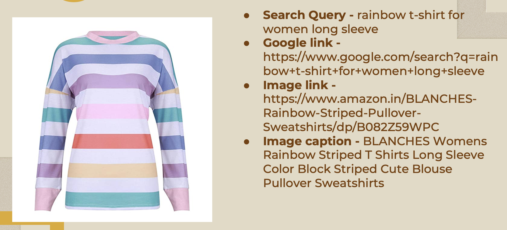
Fig: Preview of Initial Data Collection

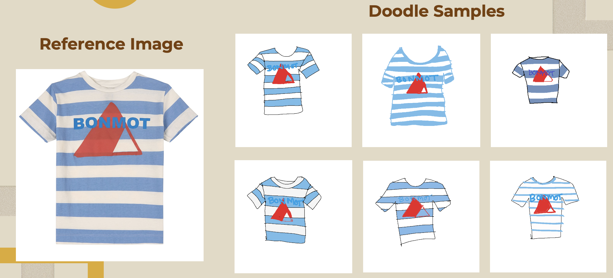
Fig: Preview of the created doodles

## Approach

The project follows these key steps:

1. **Object Annotation, Data Loading and Preprocessing**:
   - The doodles had many white spaces so using YoloV8x we detected the doodles and took the bounding box co-ordinates and cropped the images to reduce white spaces.
   - Before loading we converted all the images to RGB format.
   - We cleaned the captions as well by removing punctuations, single letters, and unnecessary words as lower-casing everything.
   - We also used the word2number library to convert all the digits into words.

## **Implementation**:

- We tested our data on several different advanced AI models for checking and comparison on which works the best.

## **Models**:
   - ****Xception encoder and Decoder model****:
   ***Xception for Image Feature Extraction***: Xception is a convolutional neural network (CNN) architecture designed for image classification tasks. It's particularly effective at capturing intricate patterns in images. In this context, Xception is used to extract high-level features from the input images. These features represent the most salient aspects of the image content, which are essential for generating relevant captions.

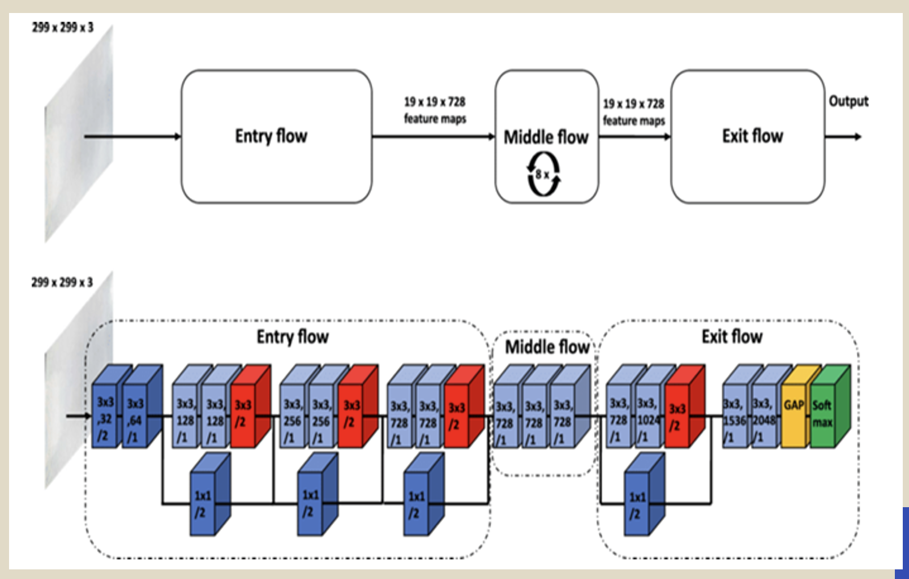
Fig: Xception architecture

***LSTM for Caption Generation***: LSTM is a type of recurrent neural network (RNN) known for its ability to model sequential data and capture long-term dependencies. In the context of caption generation, LSTM is used to generate captions word by word, considering the extracted image features as context. At each time step, the LSTM takes as input the previously generated word (or a special start token at the beginning) along with the image features. It then predicts the next word in the caption sequence. This process is repeated until an end token is generated or a maximum caption length is reached.

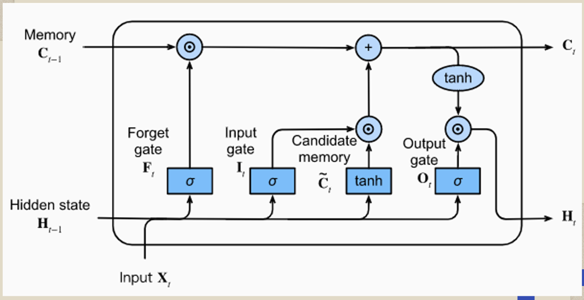
Fig: LSTM architecture

***Results:***
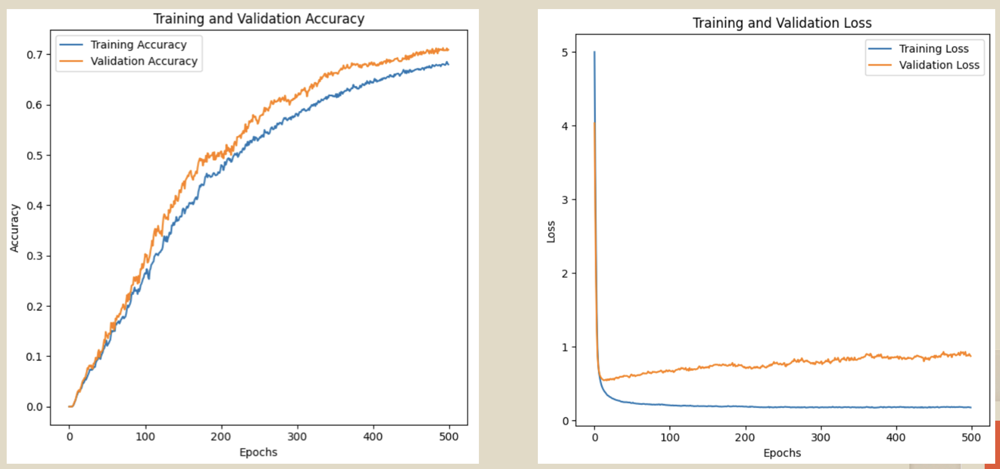
Fig: Preview of the results 

 - ****Blip-2 model****:

The BLIP-2 model is a vision-language pre-training strategy that leverages off-the-shelf frozen pre-trained image encoders and large language models. It was proposed in the paper “BLIP-2: Bootstrapping Language-Image Pre-training with Frozen Image Encoders and Large Language Models” by Junnan Li, Dongxu Li, Silvio Savarese, and Steven Hoi.

   The main components of BLIP-2 are:
   Frozen Pre-trained Image Encoders: These are used to extract visual features from images.
   Large Language Models (LLMs): These are used for text processing.
   Querying Transformer: This is a lightweight, 12-layer Transformer encoder that is trained to bridge the gap between the image encoders and the language models.
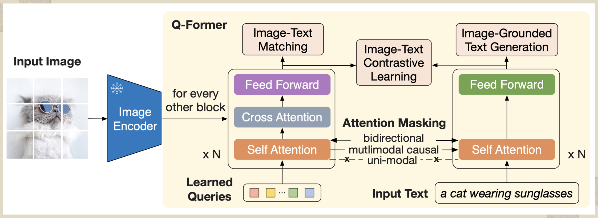
Fig: Blip-2 architecture

***Results:***
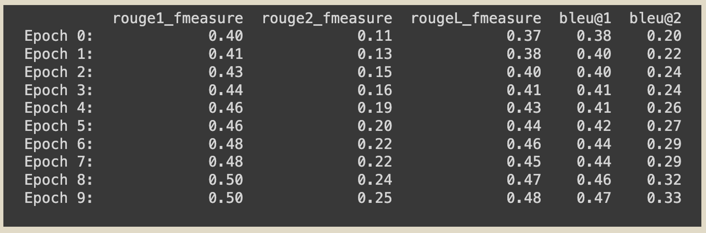
Fig: Preview of the results 

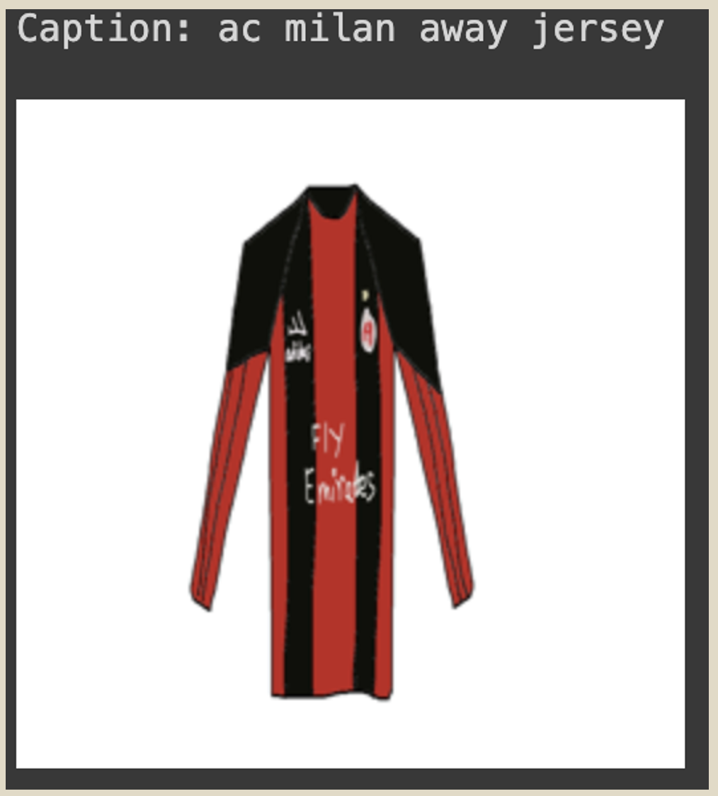
Fig: Blip-2 test output

 - ****Vision Transformer and GPT2 model****:

***Vision Transformer (ViT)***: This is used as the encoder to process visual input and extract visual features. It transforms an image into a sequence of image patches, which are then processed in a manner similar to how transformers process sequences of tokens in NLP.

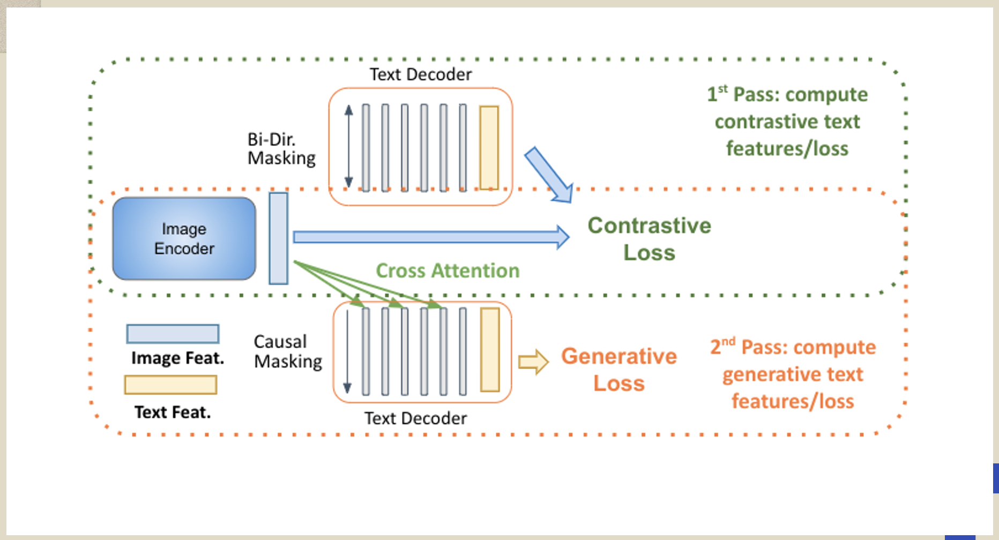
Fig: ViT architecture

***GPT-2***: This is used as the decoder to generate textual captions based on the visual context. It takes the output of the ViT and generates a sequence of words to form a caption.

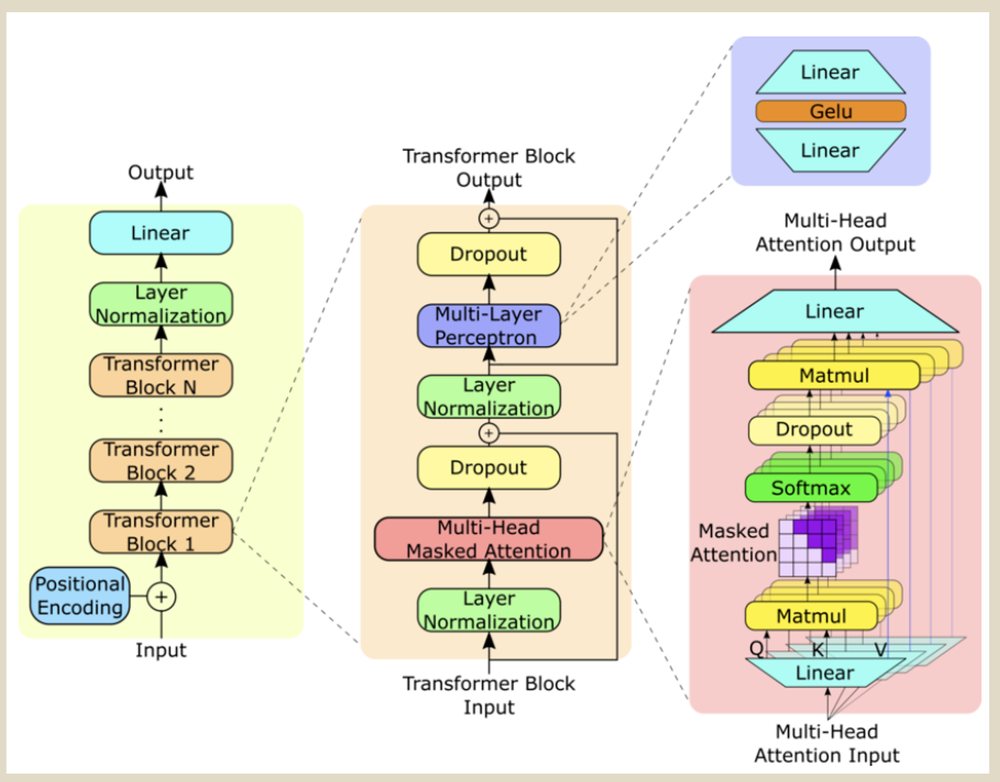
Fig: GPT2 architecture

***Results:***
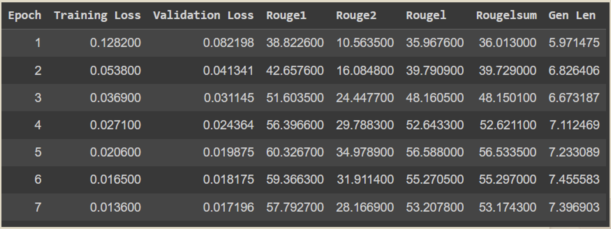
Fig: Preview of the results 

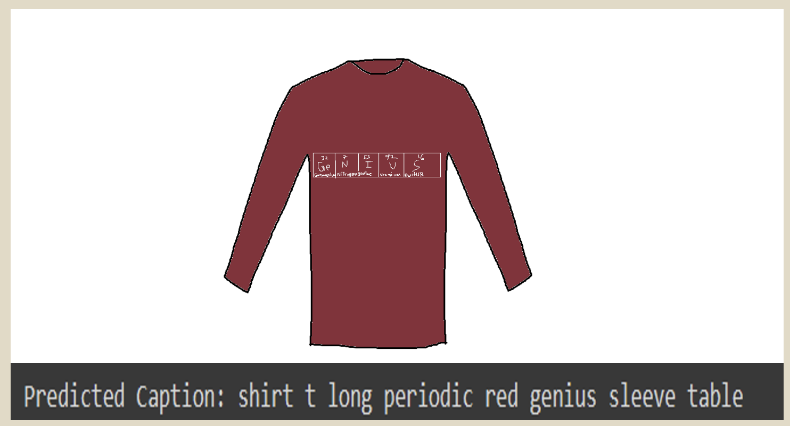
Fig: Vision Transformer and GPT2 test output

- ****Restnet50 and LSTM model****:

ResNet-50 is a variant of the ResNet model, which stands for Residual Network1. It is a convolutional neural network that is 50 layers deep, including 48 convolutional layers, one MaxPool layer, and one average pool layer12. Here are some key characteristics:

***Residual Blocks***: ResNet forms networks by stacking residual blocks. A residual block uses a shortcut connection that “skips over” some layers, converting a regular network into a residual network.

***Bottleneck Design***: The 50-layer ResNet uses a bottleneck design for the building block. A bottleneck residual block uses 1x1 convolutions, known as a “bottleneck”, which reduces the number of parameters and matrix multiplications.
Pretrained on ImageNet: The pre-trained neural network can classify images into 1000 object categories.

***Performance***: Despite its depth, ResNet-50 is less complex than VGGNet and can achieve faster performance.

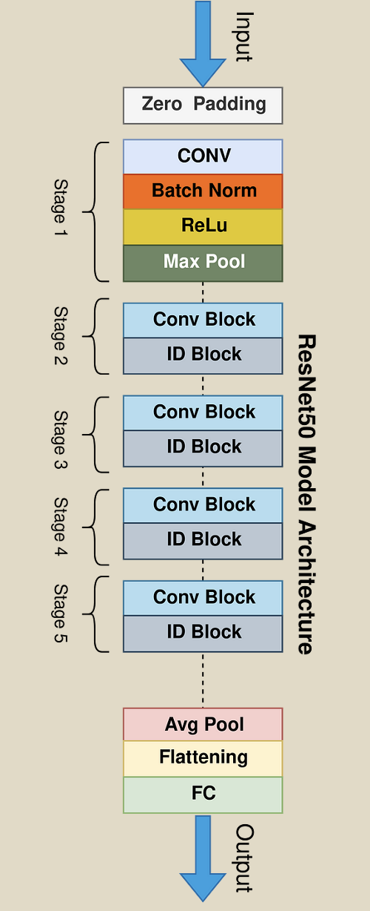

Fig: Restnet50 architecture

***Results:***
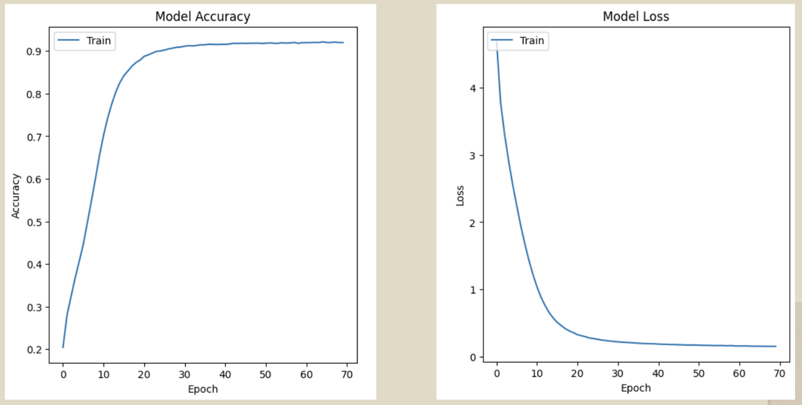
Fig: Preview of the results 

## Usage

To run this project locally, you can follow these steps:
 - Clone the repository to your local machine.
 - Run the project's main script to generate a search query.

## The project is organized as follows:

- `Copy_of_BLIP_2.ipynb`: Jupyter notebooks with code for Blip-2 worked in a small dataset.
- `Final_Doodle_Reformat.ipynb`: Jupyter notebooks with code for data preprocessing, model training, and evaluation for all the models.
- `README.md`: This file.

## Dependencies

The project utilizes the following Python libraries:
- NumPy
- pandas
- matplotlib
- transformer
- accelerators
- TensorFlow
- Keras
- word2number
- nltk

These dependencies can be easily installed using the `pip install` command.

## Author

This project was created by MD Fahim Afridi Ani. You can contact the author via Email: fahimafridi043@gmail.com.

Enjoy exploring and trying to get search queries from doodle cloth images!
